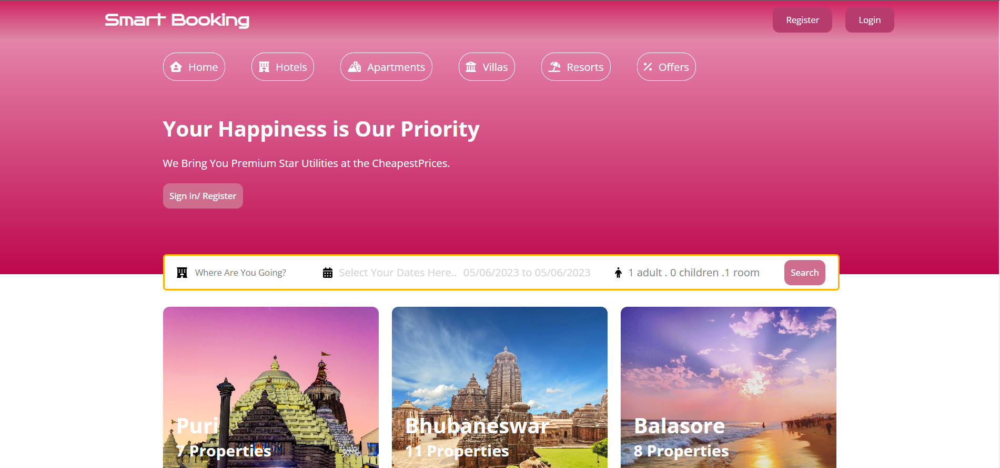

# Smart-Booking

**Client Page**

After Login 

**Admin Page**

To set up and run a Node.js and React.js project, follow these steps:
Used skills are 
1. HTML  2. CSS   3. JS   4. React JS   5. Redux   6. Node JS   7. Express JS  8. MongoDB
9. Ensure that you have Node.js installed on your machine. You can download and install the latest LTS version from the official Node.js website

10. Clone the project repository from GitHub to your local machine using the `git clone` command or by downloading the repository as a ZIP file and extracting it.

11. Open a terminal or command prompt and navigate to the project directory.
   a.client  (client site code)
   b.api   (backend )
   c.admin (admin penal code)

12. Navigate to the client directory (where the React.js code resides) using `cd client`. Install project dependencies by running the command  `yarn install` .This will read the `package.json` file and install the required packages. and then run the command `yarn start`.

13. Navigate to the admin directory (where the React.js code resides) using `cd admin`. Install project dependencies by running the command  `yarn install` .This will read the `package.json` file and install the required packages. and then run the command `yarn start`.

14.  Navigate to the api directory  using `cd api`. Install project dependencies by running the command  `yarn install` .This will read the `package.json` file and install the required packages. and then run the command `yarn start`.

15. Open a web browser and visit `http://localhost:3000` to view the React.js application.

